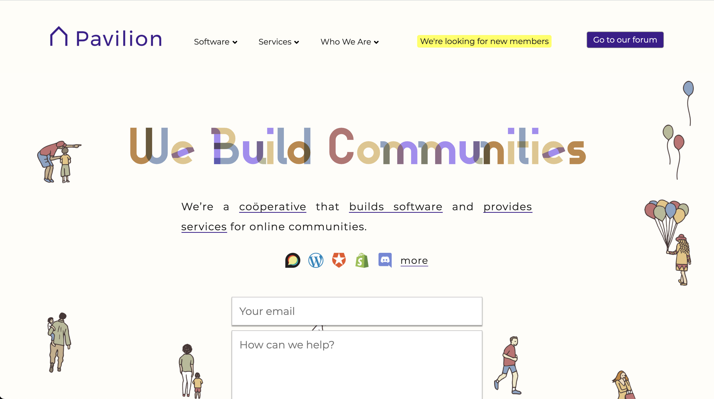

|:-----------------------|:------------------------------------------------------------------------------|
| ℹ️ **Summary**         | Enables the creation of landing pages for a [Discourse] installation          | 
| 🛠 **Repository link** | <https://github.com/paviliondev/discourse-landing-pages>                      |
| 📖 **Install guide**   | [How to install plugins in Discourse]                                         |
| 🆘 **Support**         | For bug reports, feature requests and general questions open a [Github issue] |

The **Landing Pages plugin** lets you make standalone landing pages for your Discourse instance. You can display topics, users and other content from your forum. You can restrict pages to groups, apply Discourse themes, set custom paths, and manage pages in a dedicated git repository.

**Not sure where to start?** You can review how to [add a new landing page] to your forum, or read how to handle [global attributes] that can be shared among all your landing pages.

[Discourse]: https://www.discourse.org/
[How to install plugins in Discourse]: https://meta.discourse.org/t/install-plugins-in-discourse/19157
[Github issue]: https://github.com/paviliondev/discourse-landing-pages/issues
[add a new landing page]: add-and-edit
[global attributes]: global
